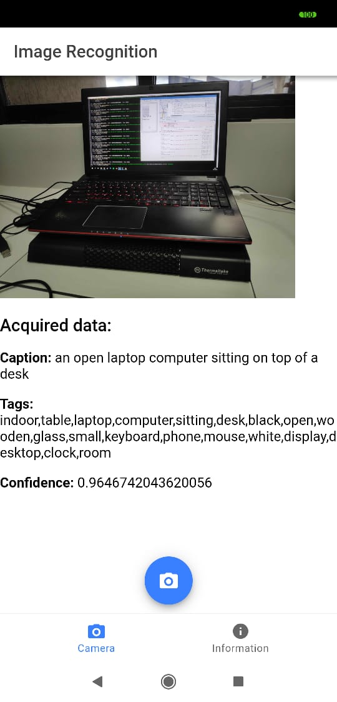
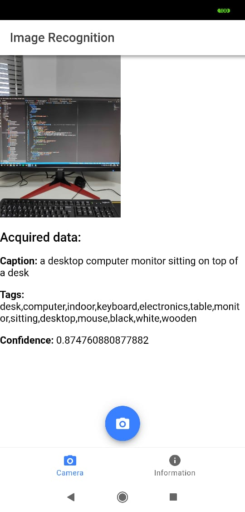
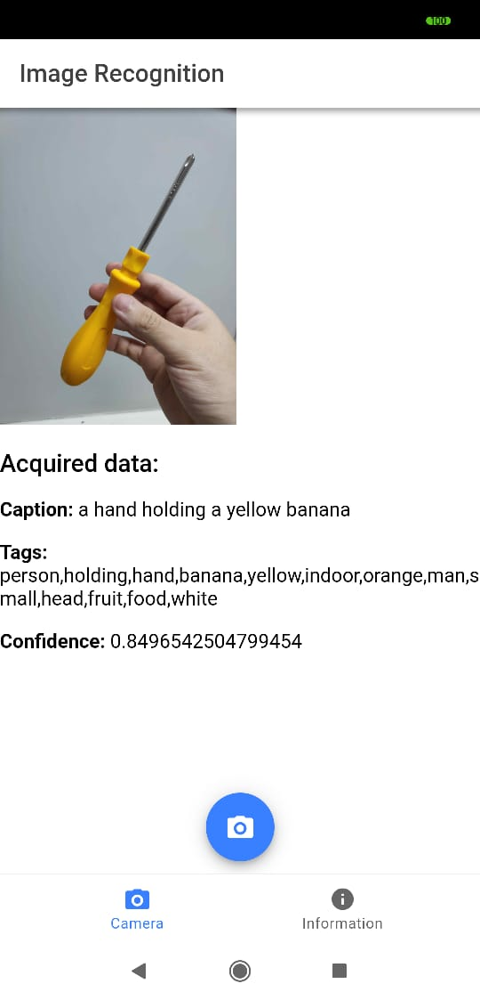
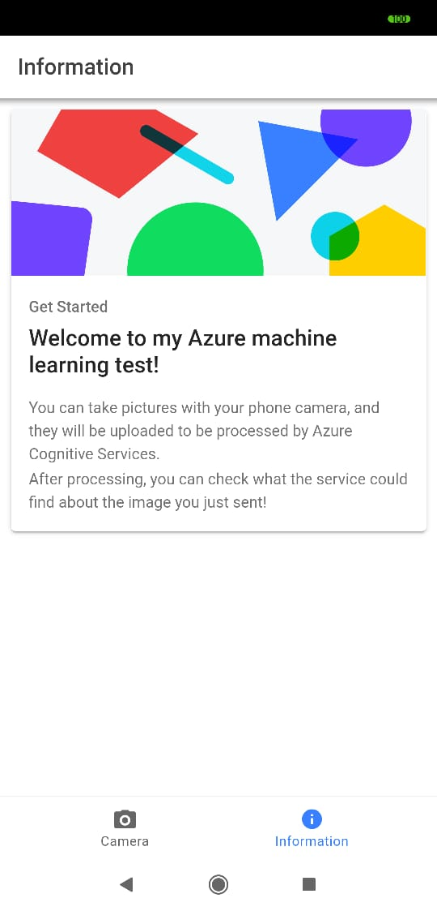

# Azure Computer Vision with Ionic v4

A simple application where the user can take a picture that is then processed by Azure Computer Vision to show some information about it

## How to Run Locally
* Clone this repo.
* Open a terminal window, and navigate to this repo on the filesystem.
* Run "npm install" to install all required project dependencies. 
* Run "ionic serve" to run the app in a web browser locally.

The generated .apk is available on the repository for testing purposes

## Screenshots of the app running on a native android phone
 |  |  | 
:-------------------------:|:-------------------------:|:-------------------------:|:-------------------------:
